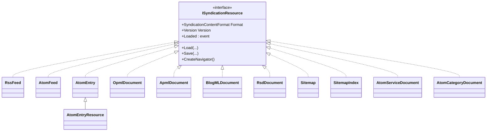
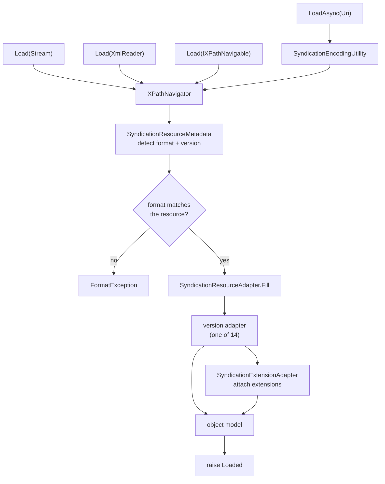
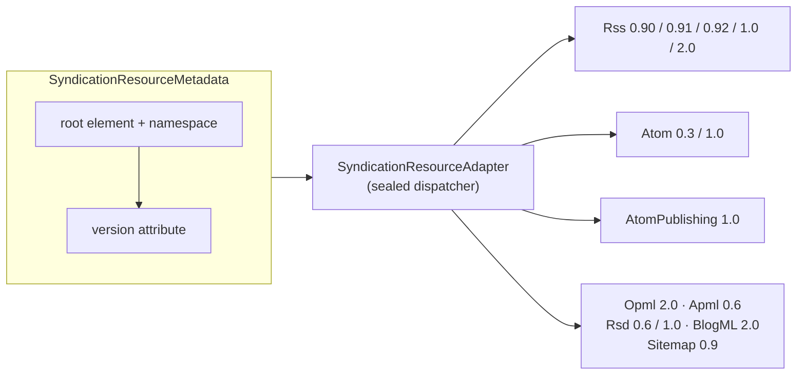
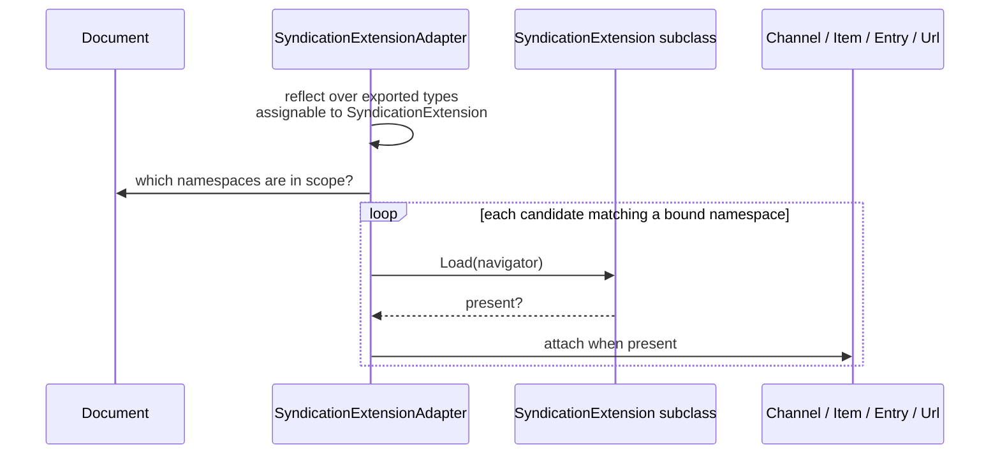

# Architecture

How Argotic is put together, and why. This is the conceptual companion to the API reference in the
[README](README.md) and the per-package documents under `Solutions/*/README.md` — it covers the shape
of the library rather than the signatures, and records the reasoning behind the parts that are not
obvious from the outside.

Argotic reads and writes eight syndication formats, the Atom Publishing Protocol, and 27 syndication
extensions. It was written in 2007 against .NET Framework idioms and modernised to .NET 10 in
2025–2026; the last section covers what that changed and what it deliberately did not.

## Contents

- [The shape every resource shares](#the-shape-every-resource-shares)
- [The load pipeline](#the-load-pipeline)
- [Format detection and dispatch](#format-detection-and-dispatch)
- [Extensions: discovery, attachment, and writing back](#extensions-discovery-attachment-and-writing-back)
- [The network layer](#the-network-layer)
- [Testing strategy](#testing-strategy)
- [The .NET 10 modernisation](#the-net-10-modernisation)

## The shape every resource shares

Every format is a class implementing `ISyndicationResource`, and every one of them exposes the same
surface. Learn it once and `OpmlDocument` works like `RssFeed`.

```
Load(IXPathNavigable | Stream | XmlReader [, SyndicationResourceLoadSettings])
LoadAsync(Uri [, HttpClient, settings, requestOptions], CancellationToken)
static CreateAsync(Uri, …)                     // load in one call
Save(Stream | XmlWriter [, SyndicationResourceSaveSettings])
```

The uniformity is the point. A consumer who has learned one resource has learned all of them, and code
that works over `ISyndicationResource` works over formats that did not exist when it was written.



`AtomEntryResource` deriving from `AtomEntry` is load-bearing rather than incidental: the dispatcher's
Atom arm pattern-matches on `AtomEntry`, so a Publishing member is filled by the same adapters as any
other entry and picks up its publication state on top.

`GenericSyndicationFeed` sits outside this hierarchy on purpose. It wraps whichever of RSS or Atom the
document turns out to be and exposes the subset they share, for callers who do not know or care which
they were handed.

## The load pipeline

Seven public `Load` overloads and two `LoadAsync` overloads all funnel into **one** private
`Load(XPathNavigator, settings, eventData)` per resource. Everything above that line is about getting
bytes to a navigator; everything below is about filling the object model.



Two properties fall out of that funnel and are worth stating because consumers depend on them:

- **`Loaded` is raised exactly once per load**, from the single private method, whichever overload was
  called.
- **Parsing is `XPathNavigator`-based throughout.** Adapters walk a navigator rather than a reader, so
  they can look ahead and revisit — which is what makes namespace-scoped extension detection possible
  at all.

## Format detection and dispatch

`SyndicationResourceMetadata` inspects the navigator and reports what the document actually is: its
format, and the version it declares. The resource then hands both to `SyndicationResourceAdapter`,
which routes to one of 14 version-specific adapters.



Three decisions in this layer are not obvious and are easy to get wrong when changing it:

**The dispatcher is not the adapters' base class.** It used to be, which gave all 14 adapters a public
`Fill(ISyndicationResource, SyndicationContentFormat)` that nothing called. They now derive from
`SyndicationResourceAdapterBase`, which carries only the navigator and settings.

**A declared version that no adapter reads is refused, not ignored.** `<rss version="0.93">` used to
produce an empty feed and a `Loaded` event with no diagnostic at all. It now throws `FormatException`
naming the version found and the versions read. Routing is deliberately tolerant of Build and Revision
components, so `2.0.1` reaches the 2.0 adapter rather than falling through — `System.Version` equality
would have rejected it, because `new Version("2.0") != new Version("2.0.1")`.

**Formats whose specification defines no version attribute route by namespace instead.** Atom is the
case that matters: RFC 4287 defines a version attribute only on `atom:generator`, and §6.3 forbids
signalling an error on foreign markup. A `<feed version="0.5">` is therefore a feed carrying an
attribute Atom does not define, and is read as Atom 1.0 on the strength of its namespace rather than
refused.

## Extensions: discovery, attachment, and writing back

There is no registration step and no hand-maintained list. Reflection over the assembly's exported
types produces the candidate set; each candidate whose namespace or prefix is bound on the document is
asked whether it is present; and each that says yes is attached to the entity that carried its
elements.



So the only call a consumer makes is `FindExtension(MatchByType)`.

**Three qualifiers on the discovery scope are load-bearing.** It reflects over
`Assembly.GetExecutingAssembly()`, so it finds extensions in `Argotic.Extensions` and nowhere else;
`GetExportedTypes()`, so an `internal` extension silently disappears from the set; and types assignable
to `SyndicationExtension`, not to `ISyndicationExtension`, so a type implementing the interface
directly is not found.

A consumer's own extension therefore needs registering on **load** —
`settings.SupportedExtensions.Add(typeof(TheirExtension))` — but needs nothing on **save**, because
`AutoDetectExtensions` fills the supported set from the extensions actually attached to the object graph
before the namespace declarations are written. Attaching the extension is the whole of the work; no
`xmlns` is declared by hand.

**Element order is part of the contract where a schema says so.** The Google video sitemap schema
declares an `xsd:sequence`, so `tag` belongs directly after `publication_date` and not at the end. This
is exactly the kind of defect a round-trip test cannot see — the reader accepts children in any order,
so save-then-load stays symmetric over a writer that emits them wrongly. It is why conformance
validation exists as a separate tier.

## The network layer

One process-wide `HttpClient` (`SyndicationEncodingUtility.SharedHttpClient`, a `Lazy<HttpClient>` over
a configured `SocketsHttpHandler`), plus an overload on every async entry point taking a caller-supplied
client for `IHttpClientFactory` scenarios.

**Timeouts are enforced by `CancellationTokenSource.CancelAfter`, not by `HttpClient.Timeout`.** The
shared client is deliberately created with `Timeout.InfiniteTimeSpan`, because a client-level timeout is
a property of the client and this one is shared by every caller in the process — one caller's deadline
would silently become everyone's. `SyndicationResourceLoadSettings.Timeout` is linked to the caller's
own `CancellationToken`, so both are honoured and neither is imposed on anyone else.

`TimeSpan.Zero` is not how you spell "no timeout"; it cancels immediately. Leave `Timeout` unset.

## Testing strategy

Two layers and two tiers, and the distinctions are enforced rather than conventional.

|                  |                                                                            |
|------------------|----------------------------------------------------------------------------|
| `Functionality/` | Mirrors the product namespace. Contracts, guards, property behaviour.      |
| `Scenarios/`     | Named for what the consumer is doing. Must span at least two public calls. |

| Tier             | Reaches                                              | In the gate    |
|------------------|------------------------------------------------------|----------------|
| default          | Embedded schemas, linked fixtures, loopback HTTP     | yes            |
| `Integration`    | Google's schemas, the W3C Feed Validator, live feeds | run explicitly |
| `SiteMonitoring` | Whether endjin.com publishes conformant documents    | run explicitly |

**HTTP never leaves the machine in the default tier.** A mock handler covers anything reachable through
an `HttpClient` parameter; an `HttpListener` on 127.0.0.1 covers the two seams a mock cannot reach — the
shared-client convenience overloads, which bind no handler, and `SocketsHttpHandler` behaviour itself.

**Conformance validation is separate because round-trip tests are structurally blind to writer
defects.** The offline tier validates against embedded sitemaps.org and APML schemas; the integration
tier fetches Google's schemas at test time, because they carry an "All Rights Reserved" notice and are
therefore never vendored. An integration test never passes without reaching its service — unreachable is
inconclusive, and only a rejected document fails.

## The .NET 10 modernisation

Argotic was written in 2007. The modernisation targeted `net10.0` with `LangVersion 14.0` and accepted
breaking public API changes where they were improvements.

**What changed:**

- **Async and `HttpClient` throughout.** `WebRequest`, `WebClient` and the APM
  `Begin*`/`End*` pattern are gone. Every network entry point is `Task`-returning and takes a
  `CancellationToken`.
- **Nullable reference types**, with `<WarningsAsErrors>nullable</WarningsAsErrors>` — the annotations
  are part of the shipped API, so a regression fails the build.
- **Silent failure removed from the dispatcher.** Unknown versions, wrong runtime types and
  detected-but-unread formats now throw rather than returning an empty object and raising `Loaded`.
- **Sitemap loads routed through the adapter** like every other format, instead of a duplicated private
  walk that ignored the format check.
- **New extensions for formats that post-date the original**: Podcasting 2.0, GeoRSS including GML, and
  the Google sitemap hreflang, image, news and video extensions.
- **C# 14 features where they earn their place**: `extension` blocks, the `field` keyword, and
  `[GeneratedRegex]`.

**What deliberately did not change:**

- **The object model's shape.** `RssFeed.Channel.Items` is where it always was. The point of the exercise
  was to modernise the machinery without making existing knowledge worthless.
- **Lenient reading.** Argotic still reads documents that are not strictly valid, because real feeds are
  not strictly valid and a reader that refuses them is useless. The strictness added is about the
  library's own *answers* — refusing to claim success on a document it did not understand — not about
  refusing input.
- **`XPathNavigator` parsing.** A streaming reader would allocate less, but the extension model depends
  on being able to revisit the document, and no measurement suggested the trade was worth making.

The full list of breaking changes is in [CHANGELOG.md](CHANGELOG.md).
